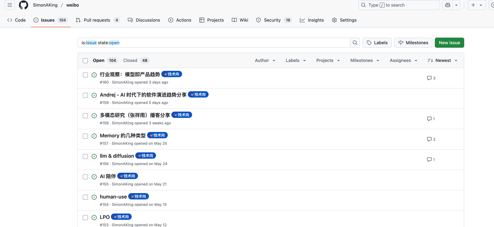
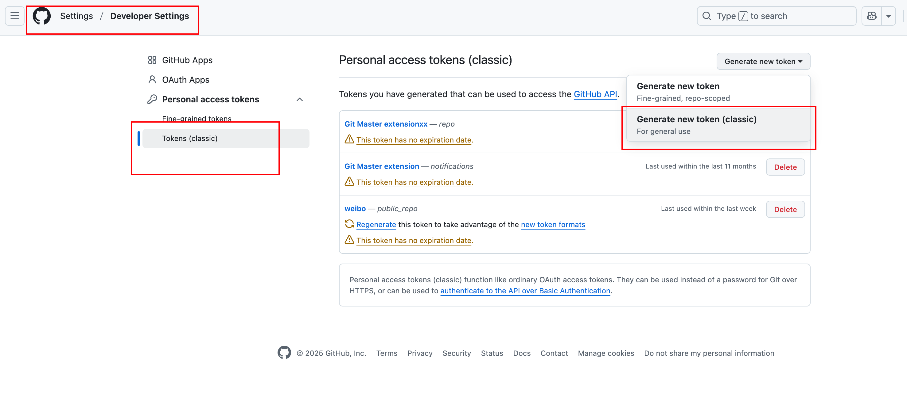
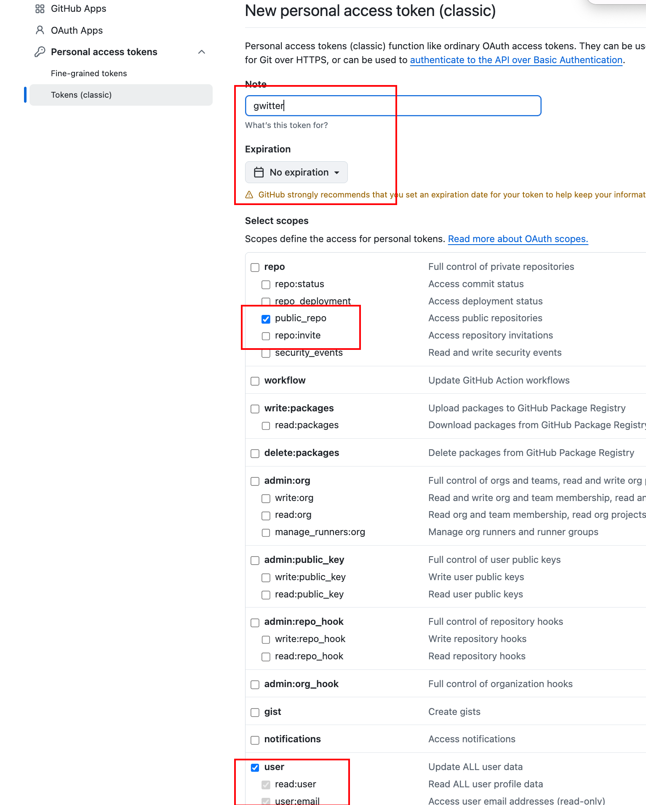
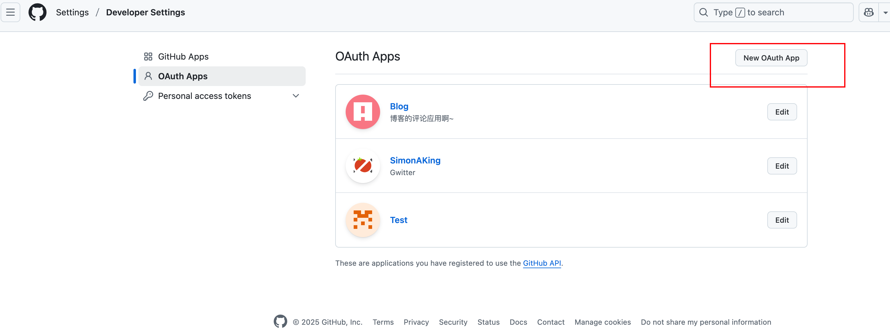
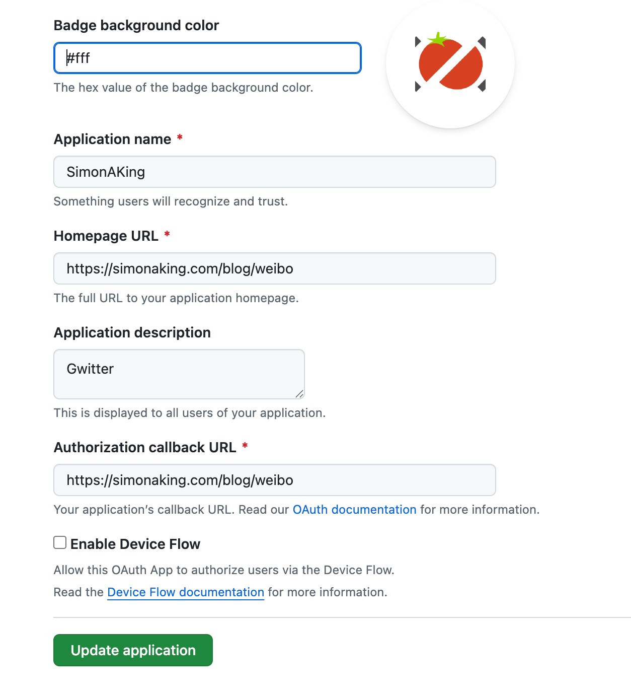
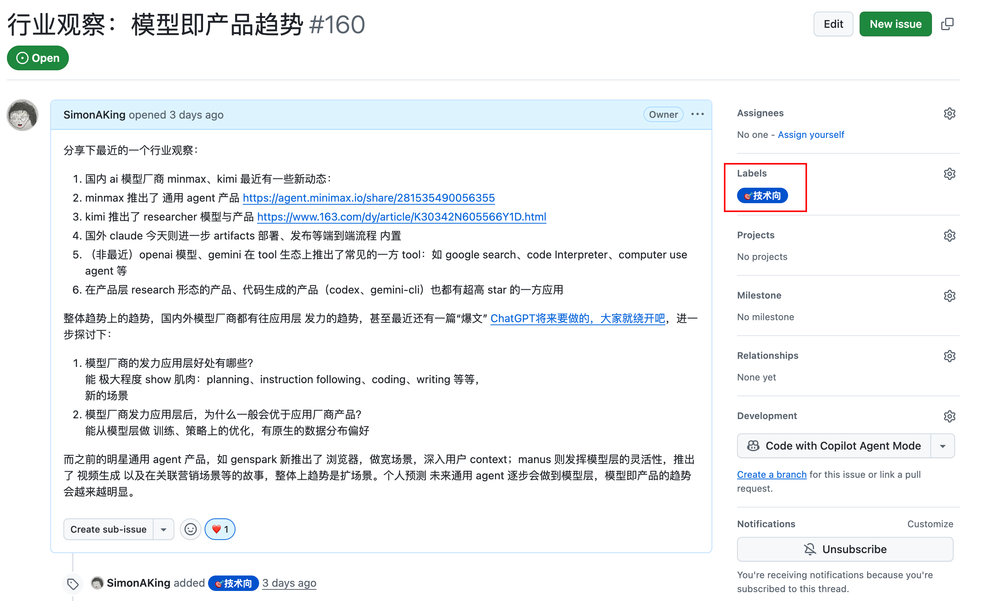

# Gwitter

[中文版本](README.zh_CN.md.md)

## 🎮 Playground

- **🌐 Live Demo**: [https://simonaking.com/gwitter](https://simonaking.com/gwitter) - Experience Gwitter in action
- **💭 Share Your Thoughts**: [Create an Issue](https://github.com/SimonAKing/Gwitter/issues) to join the conversation
- **📚 Browse Discussions**: Explore existing thoughts and insights on the demo site

## ✨ Project Introduction

> **Origin of the Project Name** 💡
> GitHub Issues is (almost) the best note-taking app 📝
> Twitter is the world's largest microblogging platform 🐦
> So Gwitter comes from this!


Gwitter is a lightweight microblogging application built on GitHub Issues. It records my thoughts on technology, life insights, and interesting discoveries. Welcome to join the discussion!

## 🚀 Key Features

1. 📝 GitHub Issues Based
   Utilizes GitHub Issues as content storage, supporting GitHub's label system for content categorization

2. 👍 Social Interaction
   - **Like Feature**: Supports GitHub Reactions (👍 ❤️ 😄 😮 😢 😡 🚀 👀)
   - **Comment System**: Complete commenting functionality with nested replies support

3. ✨ Visual Experience
   - **Beautiful Animations**: Smooth page animations using Framer Motion
   - **Responsive Design**: Perfect adaptation for desktop, tablet, and mobile devices
   - **Skeleton Screen**: Elegant loading state display

4. 🌐 User Experience
   - **Internationalization Support**: Built-in Chinese and English bilingual support
   - **Infinite Scroll**: Smart pagination loading for smooth browsing experience

5. 🤖 Automated Synchronization
   - **Multi-platform Sync**: Automatically sync newly published Issues to other platforms via GitHub Actions

## 🛠️ Tech Stack

- **Frontend Framework**: React 18 + TypeScript
- **Build Tool**: Rsbuild (Fast build tool based on Rspack)
- **Styling Solution**: Emotion (CSS-in-JS)
- **Animation Library**: Framer Motion + React Flip Move
- **State Management**: React Hooks
- **Network Requests**: Axios + GitHub GraphQL API
- **Internationalization**: i18next
- **Code Standards**: ESLint + Prettier

## 📦 Quick Start

### Requirements

- Node.js >= 16
- pnpm >= 8 (recommended)

### 1. Clone the Project

```bash
git clone https://github.com/SimonAKing/Gwitter.git
cd Gwitter
```

### 2. Install Dependencies

```bash
pnpm install
```

### 3. Configure GitHub

#### 3.1 Create GitHub Repository

1. Create a new repository on GitHub to store your microblog content
2. Record the repository's `owner` (username) and `repo` (repository name)
> Similar to https://github.com/SimonAKing/weibo/issues


#### 3.2 Apply for GitHub Personal Access Token

1. Visit [GitHub Settings > Developer settings > Personal access tokens](https://github.com/settings/tokens)
2. Click "Generate new token (classic)"


3. Select the following permissions:
   - `repo` (Full repository access)
   - `read:user` (Read user information)
4. Generate and save the token


#### 3.3 Create GitHub OAuth Application

1. Visit [GitHub Settings > Developer settings > OAuth Apps](https://github.com/settings/developers)
2. Click "New OAuth App"


3. Fill in development and production environment application information:
   - **Application name**: Gwitter
   - **Homepage URL**: `http://localhost:3000` (development) or your deployment domain
   - **Authorization callback URL**: `http://localhost:3000` (development) or your deployment domain
4. After creation, obtain `Client ID` and `Client Secret`



#### 3.4 Configure Application

Modify the `src/config/index.ts` file:

```typescript
const config = {
  // GitHub Personal Access Token
  token: ['your_token_part1', 'your_token_part2'],

  // GitHub repository configuration
  owner: 'your_github_username',
  repo: 'your_repo_name',

  // Pagination configuration
  pageSize: 6,
  offsetTop: 1,

  // User avatar
  avatar: 'https://github.com/your_username.png',

  // OAuth configuration
  clientID: isDev ? 'dev_client_id' : 'prod_client_id',
  clientSecret: isDev ? 'dev_client_secret' : 'prod_client_secret',

  // CORS proxy (optional)
  autoProxy: 'https://cors-anywhere.azm.workers.dev/https://github.com/login/oauth/access_token',
};
```

### 4. Start Development Server

```bash
pnpm dev
```

Visit [http://localhost:3000](http://localhost:3000) to view the application.

### 5. Build and Deploy

```bash
# Build for production
pnpm build

# Preview the build result
pnpm preview
```

## 📝 Usage Instructions

### Publishing Content

1. Create a new Issue in the configured GitHub repository
2. Write content using Markdown format
3. Add appropriate labels for categorization
4. Content will automatically sync to the microblog application after publishing


### Content Management

- **Edit**: Edit directly in GitHub Issues
- **Delete**: Close the corresponding Issue
- **Categorize**: Use GitHub Labels for content categorization
- **Pin**: Control display order through Issue creation sequence

### 🤖 Automated Synchronization Configuration

Gwitter supports automatically syncing newly published Issues to Telegram and GitHub Gist via GitHub Actions.

#### Setting up Sync Features

1. **Create Sync Script**
   - Refer to [sync.js](https://github.com/SimonAKing/weibo/blob/master/sync.js) implementation
   - Create `.github/workflows/sync.yml` in the repository

2. **Configure Environment Variables**
   In GitHub repository Settings > Secrets and variables

3. **Telegram Configuration**
   - Create Telegram Bot (via @BotFather)
   - Get Bot Token and target channel/group Chat ID
   - Add Bot to target channel and grant admin permissions

## 🎨 Customization

### Modify Theme

Edit `src/components/common/IssueLayout.tsx` and related style files to customize the interface style.

### Add Features

The project uses modular design for easy feature addition:

- `src/components/`: UI components
- `src/hooks/`: Custom Hooks
- `src/utils/`: Utility functions
- `src/config/`: Configuration files

### Internationalization

Add new language files in the `src/i18n/locales/` directory and register them in `src/i18n/index.ts`.

## 🤝 Contributing

Issues and Pull Requests are welcome!

---

<div align="center">

**Thank you for your attention and support!**

If you like this project, don't forget to give it a ⭐!

Made with ❤️ by [SimonAKing](https://github.com/SimonAKing)

</div>